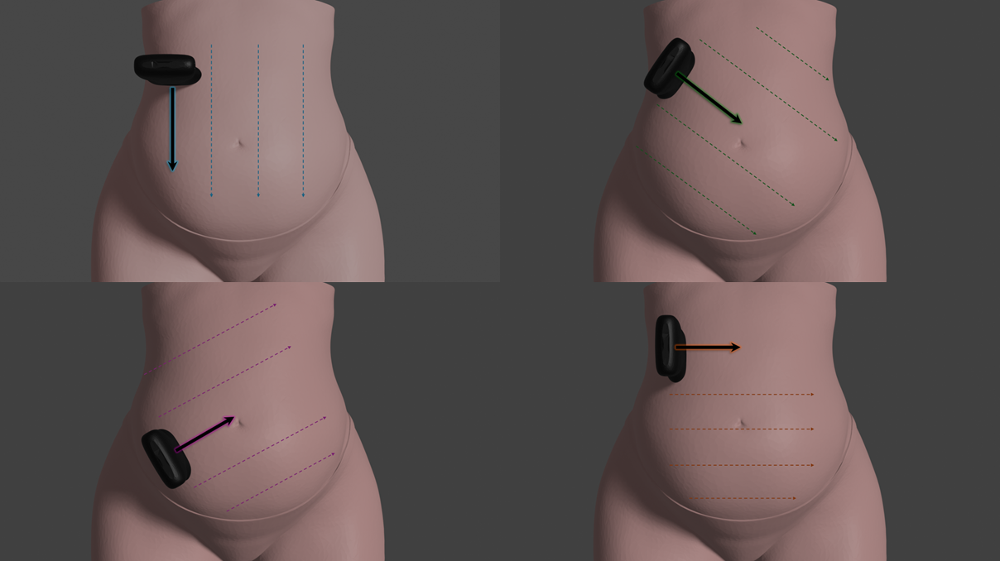
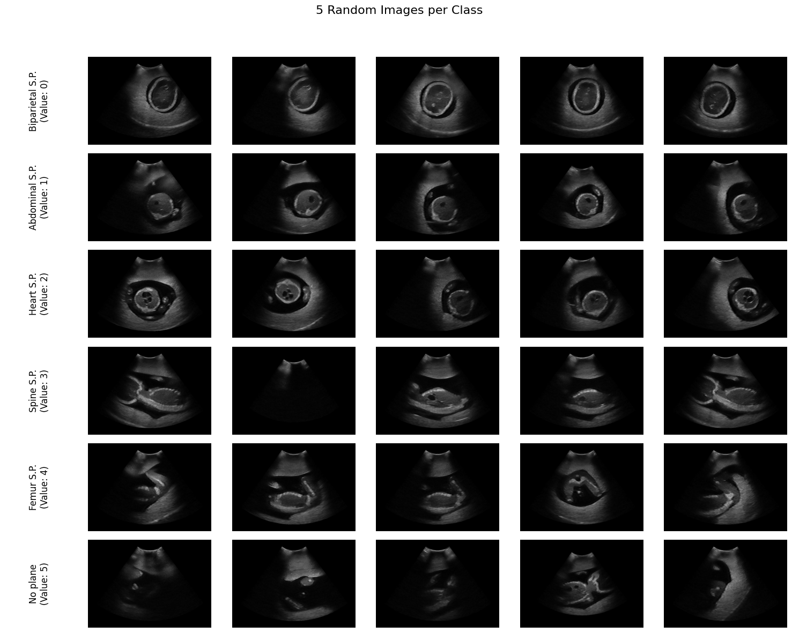

# NatalIA: PBF-US1 (Phantom Blind-sweeps for Fetal Ultrasound Scanning)

<p style="margin-bottom: 100px;">


</p>

## Overview

This Python package provides a collection of standard fetal planes generated using a US-7a SPACE FAN phantom (Kyoto Kagaku) and Clarius C3 HD3 point-of-care ultrasound device. The package is intended for use in medical education, training, and research related to fetal ultrasound imaging.

## Features

- **Standard Fetal Planes**: Includes a comprehensive set of five standard fetal planes:
  - Biparietal.
  - Abdominal.
  - Heart.
  - Femur.
  - Spine.
- **Phantom Device Simulation**: The images are generated using a phantom device, providing realistic simulated fetal anatomy of a 23 weeks fetus. The fetus orientation and presentation was changed in four different poses.
- **Free-Hand Ultrasound**: To gather all the collected images volunteers without prior experience in ultaround performe a free-hand procolo consisting in four diferent sweeps:
  - 1 Vertical.
  - 1 Horizontal.
  - 2 Diagonal.

<p align="center">
 
<p>

- **Point-Of-Care Ultrasound**:The videos were collected using a portable ultrasound with a maximum depth of 16 cm and 24 Frames Per Second.
- **Easy Integration**: Simple Python API for loading and accessing fetal plane images, facilitating integration into existing applications and workflows.
- **Open Source**: The package is open source, allowing for customization, extension, and contribution from the community.

## Installation

You can install the package via pip:

## Usage

```python
from FetalPlanesFreeHand.data_loader import download_dataset, load_images_with_metadata
from FetalPlanesFreeHand.metadata import count_elements_per_class, get_images_by_class_value, plot_random_images

# Load standard fetal planes with the metadata
download_dataset()
standard_planes = load_images_with_metadata()

class_count = count_elements_per_class()
## Class 'Biparietal standard plane' (Value: 0): 42 elements
## Class 'Abdominal standard plane' (Value: 1): 69 elements
## Class 'Heart standard plane' (Value: 2): 58 elements
## Class 'Spine standard plane' (Value: 3): 134 elements
## Class 'Femur standard plane' (Value: 4): 47 elements
## Class 'Placenta' (Value: 5): 30 elements
## Class 'No plane' (Value: 6): 19023 elements

class_count
## value
## 0       42
## 1       69
## 2       58
## 3      134
## 4       47
## 5       30
## 6    19023
## dtype: int64

class_value = 2
images_by_class_value = get_images_by_class_value(class_value)
print(f"First 10 images in class with value '{class_value}':\n{images_by_class_value.iloc[0:10]}")
## First 10 images in class with value '2':
## 77     cineframe_100_2024-05-02T08-36-34.jpeg
## 78     cineframe_100_2024-05-02T08-37-43.jpeg
## 81     cineframe_100_2024-05-02T08-38-50.jpeg
## 83     cineframe_102_2024-05-02T08-36-34.jpeg
## 84     cineframe_102_2024-05-02T08-37-43.jpeg
## 88     cineframe_105_2024-05-02T08-38-08.jpeg
## 818     cineframe_70_2024-05-02T08-58-54.jpeg
## 864    cineframe_111_2024-05-02T08-57-41.jpeg
## 865    cineframe_112_2024-05-02T08-57-41.jpeg
## 877    cineframe_123_2024-05-02T08-57-22.jpeg
## Name: name_file, dtype: object

# Show 5 random images with the name and value.
plot_random_images(5,fig_size=(15,2))
```

<p align="center">
 
<p>

## Use the planes for educational purposes, training simulations, or research

## This project was funded by CLIAS (Centro de Inteligencia Artificial y Salud para América Latina y el Caribe), an initiative of CIIPS (Centro de Implementación e Innovación de Políticas de Salud) at IECS (Instituto de Efectividad Clínica y Sanitaria), with support from IDRC (International Development Research Centre).
